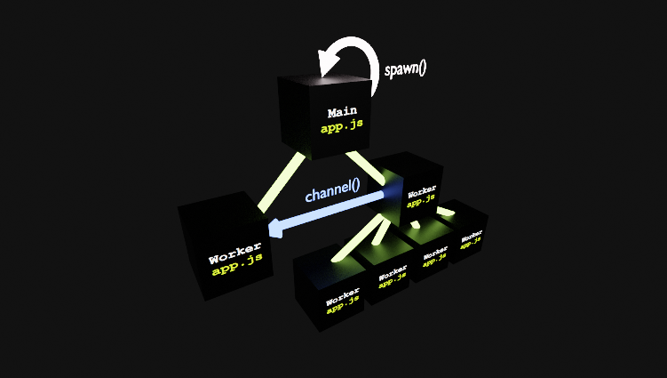

<div align='center'>

<h1>ThreadBox</h1>

<p>Recursive Worker Threads in NodeJS</p>

[](https://badge.fury.io/js/%40sinclair%2Fthreadbox)
[](https://travis-ci.org/sinclairzx81/threadbox)

</img>

</div>

### Example

The following replicates the above worker graph. See [here](./doc/example.js) for a JavaScript version.

```typescript
// app.ts

import { spawn, Main, Thread, channel, Sender, Receiver } from '@sinclair/threadbox'

@Thread() class WorkerC {
    run() {
        return Math.random()
    }
}
@Thread() class WorkerB {
    async run(sender: Sender) {
        const c_0 = spawn(WorkerC)
        const c_1 = spawn(WorkerC)
        const c_2 = spawn(WorkerC)
        const c_3 = spawn(WorkerC)
        const [a, b, c, d] = await Promise.all([
            c_0.run(),
            c_1.run(),
            c_2.run(),
            c_3.run(),
        ])
        await sender.send([a, b, c, d])
        await sender.end()
        await c_0.dispose()
        await c_1.dispose()
        await c_2.dispose()
        await c_3.dispose()
    }
}
@Thread() class WorkerA {
    async run(receiver: Receiver) {
        for await(const [a, b, c, d] of receiver) { }
    }
}
// start here ...
@Main() default class {
    async main() {
        const [sender, receiver] = channel()
        const a = spawn(WorkerA)
        const b = spawn(WorkerB)
        await Promise.all([
            a.run(receiver),
            b.run(sender) 
        ])
        await a.dispose()
        await b.dispose()
    }
}
```

<a name="Overview"></a>

## Overview

ThreadBox is a threading library for JavaScript that is built on top of NodeJS `worker_threads`. It is written to allow for compute intensive JavaScript or WASM processes to be trivially executed in remote worker threads. ThreadBox approaches this by allowing any `class` decorated with `Thread` to be spawned and instanced in a remote worker thread. ThreadBox constructs an async interface to the remote worker `class`, allowing the host thread to invoke operations on the remote worker through simple async method calls.

ThreadBox uses a recursive pattern to spawn worker threads. ThreadBox will recursively call into the applications entry module (typically `app.js`) and instance a requested `Thread` class when spawning a new worker. Because each new worker is spawned from the same entry module as the application, `class`, `function` and `const` definitions defined by the application are also available to each subsequent thread. This approach allows for ergonomic same file threading common to other languages.

ThreadBox was built as a research project and is primarily geared towards TypeScript development. It does however provide a non-decorator based fallback API for JavaScript users. This library is offered as is to anyone who may find it of use.

Built with Node 12.16.1 LTS and TypeScript 3.8.3.

Licence MIT

<a name="Install"></a>

## Install

```bash
$ npm install @sinclair/threadbox --save
```

## Contents
- [Install](#Install)
- [Overview](#Overview)
- [Setup](#Setup)
- [Main](#Main)
- [Thread](#Thread)
- [Spawn](#Spawn)
- [Channel](#Channel)
- [Select](#Select)
- [Marshal](#Marshal)
- [Mutex](#Mutex)
- [SharedArrayBuffer](#SharedArrayBuffer)

<a name="Setup"></a>

## Setup

ThreadBox primarily uses decorators to denote `Main`, `Thread` and `Marshal` class types. It also implements `[Symbol.asyncIterator]` for channels. TypeScript users should configure their environment for the following.

```javascript
// tsconfig.json
{
   "compilerOptions": {
      "experimentalDecorators": true,
      "downlevelIteration": true,
      ...
   }
}
```

<a name="Main"></a>

## Main

The `Main` decorator registers a class as the programs entry point. The classes `main(...)` function will be automatically called by ThreadBox when the program is run.

```typescript
import { Main } from '@sinclair/threadbox'

@Main() class Program {
    main() {
        console.log('Hello World')
    }
}

// JavaScript users can use __Main(Program) if
// decorators are not available.
```

<a name="Thread"></a>

## Thread

The `Thread` decorator registers a class as threadable which allows it to be spawned in a worker thread. When spawned, the host thread will be able to execute any function available on the class. The class may additionally implement an optional `dispose()` function that will be invoked when the host thread terminates the worker.

```typescript
import { Thread } from '@sinclair/threadbox'

@Thread() class Worker {
    add(a: number, b: number) {
        return a + b
    }
    dispose() { 
        console.log('disposed!')
    }
}
@Main() default class {
    async main() {
        const worker = spawn(Worker)
        const result = await worker.add(10, 20)
        await worker.dispose()
    }
}
// JavaScript users can use __Thread(Worker) if
// decorators are not available.
```

All JavaScript classes can be decorated with `@Thread()`.

<a name="Spawn"></a>

## Spawn

The `spawn(...)` function will spawn a threadable class and return a handle to caller allowing it to call methods on the remote class instance. The `spawn(...)` function may also accept the classes constructor arguments.

```typescript
import { spawn, Main, Worker } from '@sinclair/threadbox'

@Thread() class Worker {
    constructor(private message: string) {
        console.log('worker: constructor', message)
    }
    method() {
        console.log('worker: method')
    }
    dispose() {
        console.log('worker: dispose')
    }
}
@Main() default class {
    async main() {
        const worker = spawn(Worker, 'hello world')
        await worker.method()
        await worker.dispose() // important!
    }
}
```
The return type of the `spawn()` function is a `ThreadInterface` object. This `ThreadInterface` is a promisfied version of the class interface. The `ThreadInterface` also provides an additional `dispose()` function that is available irrespective of if the class has provided an implementation. Calling `dispose()` on the `ThreadInterface` will result in the worker being terminated.

<a name="Channel"></a>

## Channel

ThreadBox provides a channel API that is built upon the [MessageChannel](https://developer.mozilla.org/en-US/docs/Web/API/MessageChannel) API. ThreadBox channels implement a synchronization protocol that enables a `Sender` to optionally `await` for messages to be received by a `Receiver`. ThreadBox channels are loosely modelled on Rust mpsc [channels](https://doc.rust-lang.org/std/sync/mpsc/fn.channel.html). 

```typescript
import { channel } from '@sinclair/threadbox'

const [sender, receiver] = channel()
```

The channel `Sender` and `Receiver` types can be used to stream sequences of values between cooperating threads. The `Sender` will async buffer values if the caller does not `await` on `send()`. The `Receiver` type implements `[Symbol.asyncIterator]` so can be used with `for-await-of`.

#### Example 1

The following creates a channel inside the `Main` thread and sends the `Sender` to the worker thread. The worker thread will emit values to the `Sender` which are iterated on within the `Main` thread.

```typescript
import { spawn, Main, Worker, channel, Sender, Receiver } from '@sinclair/threadbox'

@Thread() class Worker {
    async execute(sender: Sender<number>) {
        await sender.send(1)
        await sender.send(2)
        await sender.send(3)
        await sender.end() // EOF
    }
}

@Main() default class {
    main() {
        const worker = spawn(Worker)
        const [sender, receiver] = channel<number>()

        worker.execute(sender) // move to worker
        
        for await(const value of receiver) {
            console.log('recv', value)
        }
        
        await worker.dispose()
    }
}
```

#### Example 2

The following creates a channel inside the worker thread and returns a `Receiver` on its `stream()` function. The `Main` thread then spawns the worker thread and calls `stream()` and awaits for the `Receiver`. It then iterates on the `Receiver`. The `into()` function is a util function that allows one to move into an async context.

```typescript
import { spawn, into, Main, Worker, channel, Sender, Receiver } from '@sinclair/threadbox'

@Thread() class Worker {
    stream(): Receiver<number> {
        const [sender, receiver] = channel<number>()
        into(async() => {
            await sender.send(1)
            await sender.send(2)
            await sender.send(3)
            await sender.end()
        })
        return receiver // move to host
    }
}

@Main() default class {
    main() {
        const worker = spawn(Worker)
        const stream = await worker.stream()

        for await(const value of stream) {
            console.log('recv', value)
        }
        await worker.dispose()
    }
}
```

<a name="Select"></a>

## Select

Using channels, its possible to receive on multiple receivers using the `select()` function. The following demonstrates its use.

```typescript
import { channel, select } from '@sinclair/threadbox'

// setup some channels...
const [sender0, receiver0] = channel<number>()
const [sender1, receiver1] = channel<string>()
const [sender2, receiver2] = channel<boolean>()

// send some values...
sender0.send(42)
sender1.send('hello')
sender2.send(true)

// receive from any...
for await(const value of select([receiver0, receiver1, receiver2])) {
    // value is number | string | boolean
}
```

<a name="Marshal"></a>

## Marshal

The `Marshal` decorator registers a class as marshalled. This enables instances of the class to be sent and reconstructed across thread boundaries. ThreadBox will automatically marshal all classes marked with `Marshal` across `Thread` function calls, as well as across a channel `Sender`.

This functionality allows class instances to be transferred to remote threads for remote invocation.

```typescript

import { spawn, Main, Thread, Marshal } from '@sinclair/threadbox'

// Instances of this class can be sent between threads.
@Marshal() class Transferrable {
    method() {
        console.log('Hello World')
    }
}
@Thread() class Worker {
    execute(instance: Transferrable) {
        instance.method() // callable
    }
}
@Main() default class {
    async main() {
        const worker = spawn(Worker)
        const instance = new Transferrable()
        await worker.execute(instance)
        await worker.dispose()
    }
}

// JavaScript users can use __Marshal(Foo) if
// decorators are not available.
```
Note: There is a serialization cost to marshaling. For performance, only `Marshal` when you need to move logic in and out of threads.

<a name="Mutex"></a>

## Mutex

ThreadBox provides a `Mutex` primitive that is built upon JavaScript [Atomics](https://developer.mozilla.org/en-US/docs/Web/JavaScript/Reference/Global_Objects/Atomics). It is used to enter into critical sections of code.

```typescript
import { Mutex } from '@sinclair/threadbox'

const mutex = new Mutex()

const lock = mutex.lock()

// critical section

lock.dispose()
```

The example below spawns 4 instances of the `Worker` class. A `Mutex` instance is passed into each worker where by the worker takes a `MutexLock` on the `execute()` method. The worker thread holds onto their respective lock for 1 second before releasing. Only 1 of the 4 workers will execute the critical section (below) at one time. The timeout is used to demonstrate the locking behavior.

```typescript
import { spawn, Main, Thread, Mutex } from '@sinclair/threadbox'

@Thread() class Worker {
    execute(mutex: Mutex) {
        const lock = mutex.lock()
        //
        // critical section !!
        //
        setTimeout(() => lock.dispose(), 1000)
    }
}
@Main() default class {
    async main() {
        const worker_0 = spawn(Worker)
        const worker_1 = spawn(Worker)
        const worker_2 = spawn(Worker)
        const worker_3 = spawn(Worker)

        const mutex  = new Mutex()
        await Promise.all([
            worker_0.execute(mutex),
            worker_1.execute(mutex),
            worker_2.execute(mutex),
            worker_3.execute(mutex)
        ]) // .. 4 seconds approx

        await worker_0.dispose()
        await worker_1.dispose()
        await worker_2.dispose()
        await worker_3.dispose()
    }
}
```

<a name="SharedArrayBuffer"></a>

## SharedArrayBuffer

The following demonstrates using `SharedArrayBuffer` to parallelize operations performed across a shared `Float32Array`. The shared buffer is sent to 4 workers with an index to store the result.

```typescript
import { spawn, Main, Worker } from '@sinclair/threadbox'

@Thread() class ComputeForIndex {
    execute(buffer: Float32Array, index: number) {
        // sleep 5 seconds
        const started = Date.now()
        while((Date.now() - started) < 5000) {}
        buffer[index] = Math.random()
    }
}

@Main() default class {
    async main() {
        // 4 x 32bit floats
        const shared = new SharedArrayBuffer(4 * Float32Array.BYTES_PER_ELEMENT)
        const buffer = new Float32Array(shared)

        // spin up 4 workers
        const c_0 = spawn(ComputeForIndex)
        const c_1 = spawn(ComputeForIndex)
        const c_2 = spawn(ComputeForIndex)
        const c_3 = spawn(ComputeForIndex)

        // process in parallel
        await Promise.all([
            c_0.execute(buffer, 0),
            c_1.execute(buffer, 1),
            c_2.execute(buffer, 2),
            c_3.execute(buffer, 3)
        ])

        // clean up
        await c_0.dispose()
        await c_1.dispose()
        await c_2.dispose()
        await c_3.dispose()

        // result
        console.log('result', buffer)
    }
}
```
