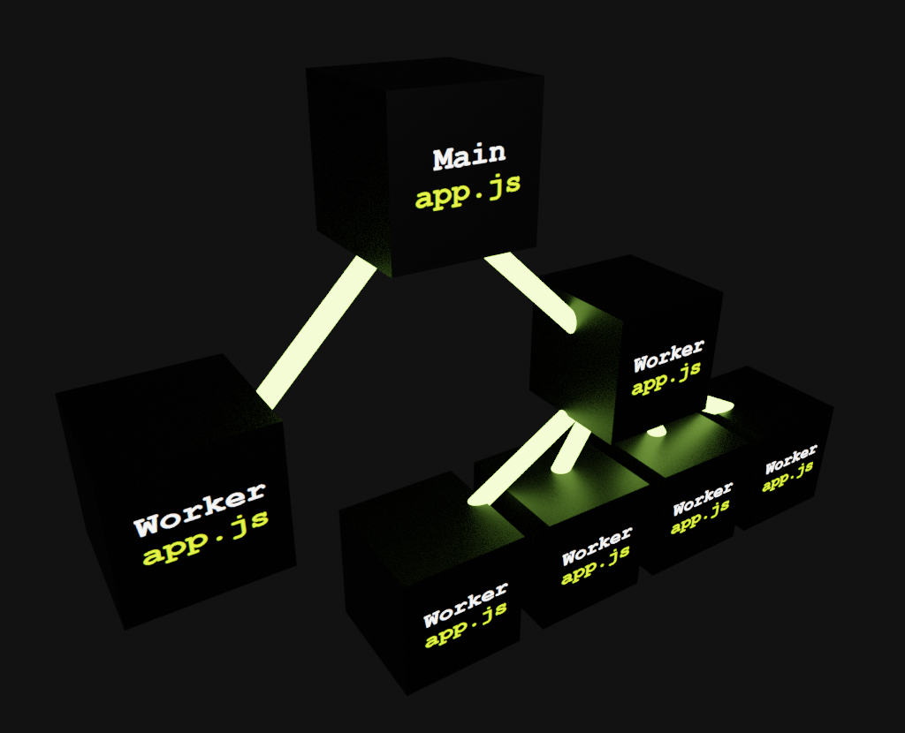

<div align='center'>

<h1>ThreadBox</h1>

<p>Recursive Multi-Threaded Worker Processes in NodeJS</p>

[](https://badge.fury.io/js/%40sinclair%2Fthreadbox)
[](https://travis-ci.org/sinclairzx81/threadbox)

</img>

</div>

## Example

As above

```typescript
import { spawn, Main, Worker } from '@sinclair/threadbox'

@Worker() class WorkerA {
    run() {
        // do work
    }
}
@Worker() class WorkerC {
    run() {
        // do work
    }
}
@Worker() class WorkerB {
    async run() {
        const c_0 = spawn(WorkerC)
        const c_1 = spawn(WorkerC)
        const c_2 = spawn(WorkerC)
        const c_3 = spawn(WorkerC)
        await Promise.all([
            c_0.run(),
            c_1.run(),
            c_2.run(),
            c_3.run(),
        ])
        await c_0.dispose()
        await c_1.dispose()
        await c_2.dispose()
        await c_3.dispose()
    }
}
@Main() default class {
    async main() {
        const a = spawn(WorkerA)
        const b = spawn(WorkerB)
        await Promise.all([
            a.run(),
            b.run() 
        ])
        await a.dispose()
        await b.dispose()
    }
}
```

<a name="Overview"></a>
## Overview

ThreadBox is a threading library for NodeJS. It is built on top of the NodeJS `worker_threads` API and uses a recursive pattern to spawn new worker threads. ThreadBox will spin up the application entry module (typically `app.js`) for each spawned worker. Because each spawned worker shares the same entry as the main thread, `class` and `function` definitions are available to each spawned worker. This pattern allows for same file threading and generally a more intuitive programming model than spreading related logic across multiple `.js` files.

ThreadBox is primarily written for use with TypeScript but does provide a no decorator fallback API for JavaScript users. This library is offered as is to anyone who may find it of use.

Built with Node 12.16.1 LTS and TypeScript 3.8.3.

Licence MIT

<a name="Install"></a>

## Install
```bash
$ npm install @sinclair/threadbox --save
```

## Contents
- [Install](#Install)
- [Overview](Overview)
- [Main](#Main)
- [Worker](#Worker)
- [Transfer](#Transfer)
- [spawn](#spawn)

<a name="Main"></a>
## Main

A decorator that denotes a class as the program entry point. The classes `main(...)` function will be called when the program is run. There can only be one `@Main()` entry point defined within the program.

```typescript

import { Main } from '@sinclair/threadbox'

@Main() class Program {
    main(argv: string[]) {
        console.log('hello world')
    }
}

// JavaScript users can use __Main(Program) if
// decorators are not available.
```

<a name="Worker"></a >
## Worker

Denotes a class as worker thread which allows it to `spawn()`. Any class may be denoted as a `@Worker()`. When spawned, the parent thread will be able to execute all of the the classes functions (see `spawn()` section for details). The classes `constructor` will be called when the worker is created and the `dispose()` method will be called when the parent thread has choosen to `dispose()` the worker.
```typescript
import { Worker } from '@sinclair/threadbox'

@Worker() class Processor {
    constructor() {
        console.log('worker started')
    }
    add(a: number, b: number) {
        return a + b
    }
    subtract(a: number, b: number) {
        return a - b
    }
    dispose() {
        console.log('worker disposed')
    }
}
// JavaScript users can use __Worker(Processor) if
// decorators are not available.
```


## Transfer
Denotes a class as being transferrable. It enables instances of this class to be marshalled across thread boundaries.
```typescript
import { Transfer } from '@sinclair/threadbox'

@Transfer() class Foo {
    method() {
        console.log('hello world')
    }
}

// JavaScript users can use __Transfer(Foo) if
// decorators are not available.
```
Internally, ThreadBox communicates between threads using  `postMessage(...)`. However, only data can be sent, not functions. Passing class instances to threads will result in a loss of that classes functions at the receiver. The `@Transfer` decorator informs ThreadBox that it should marshall and reconstruct instances of the class at the receiver.

This functionality allows logic to be passed from parent thread to worker thread without manually needing to reconstruct the appropriate class instance at the receiver.

<a name="spawn"></a >
## spawn()

Will spawn any class marked as `@Worker`. This function returns a proxy to the class which can be used to invoke the classes methods.

```typescript
import { spawn, Main, Worker, WorkerInterface } from '@sinclair/threadbox'

@Worker() class Bar {
    method() { 
        console.log('inside bar thread')
    }
}
@Worker() class Foo {
    private bar: WorkerInterface<Bar>
    constructor() {
        this.bar = spawn(Bar)
    }
    async method() {
        console.log('inside foo thread')
        await this.bar.method()
    }
    async dispose() {
        await this.bar.dispose()
    }
}

@Main() class Program {
    async main() {
        const foo = spawn(Foo)
        await foo.method()
        await foo.dispose()
    }
}
// > inside foo thread
// > inside bar thread
```
The return type of `spawn()` is a `WorkerInterface<T>`. It provides all the classes methods and one additional method named `dispose()` that will terminate the worker.

All functions on `WorkerInterface<T>` are async. 
